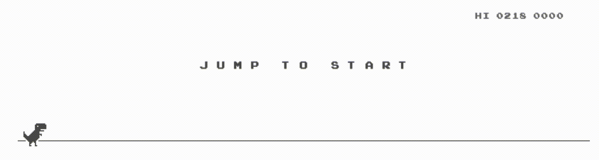
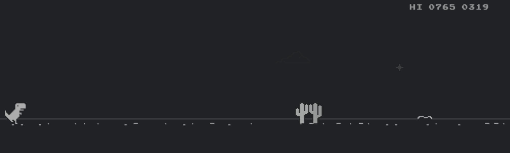
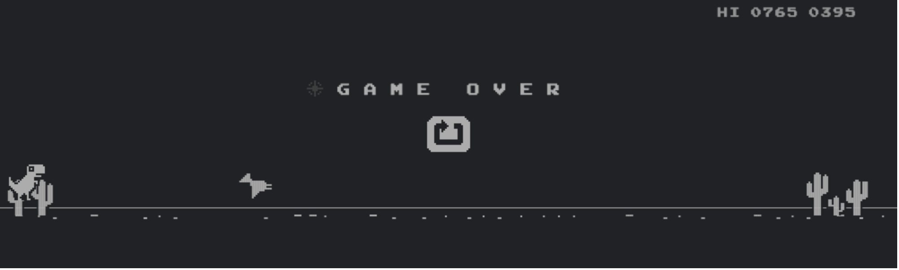

### 👉 [click here to play the game](https://karthiknedunchezhiyan.com/google-chrome-dino/) 👈

## Google Chrome Dinosaur Game

This is a recreation of everyone's favorite offline companion, [google chrome dinosaur game](https://en.wikipedia.org/wiki/Dinosaur_Game), with the same classic monochrome interface.

Live demo available [here](http://karthiknedunchezhiyan.com/google-chrome-dino/).

## Screenshots

Screenshot 1             |
:-------------------------:

Screenshot 2             |
:-------------------------:

Screenshot 3             |
:-------------------------:

Screenshot 4             |
:-------------------------:

## Functionality

- ✅ Cactus obstacles.
- ✅ Bird obstacles.
- ✅ Spacebar keypress on PC or click on touch devices should make the dino jump.
- ✅ Parallax view.
- ✅ Mobile responsiveness.
- ✅ Gradual increase in game speed.
- ✅ Day and night cycle.
- ⬜️ Duck position.
- ⬜️ Small jump on quick tap.

## Contributing

Suggestions are always welcome
